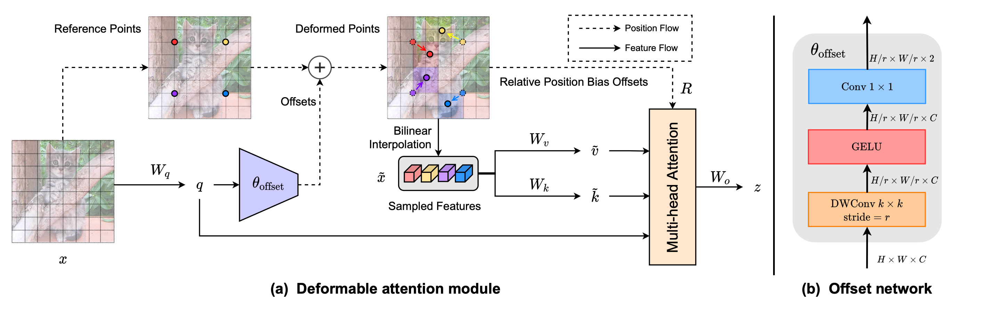

# Vision Transformer with Deformable Attention

This repository contains the code for the paper Vision Transformer with Deformable Attention \[[arXiv](https://arxiv.org/abs/2201.00520)\]. 

## Introduction



Deformable attention is proposed to model the relations among tokens effectively under the guidance of the important regions in the feature maps. This flexible scheme enables the self-attention module to focus on relevant regions and capture more informative features. On this basis, we present **Deformable Attention Transformer (DAT)**, a general backbone model with deformable attention for both image classification and other dense prediction tasks.

## Dependencies

- NVIDIA GPU + CUDA 11.1
- Python 3.8 (Recommend to use Anaconda)
- PyTorch == 1.8.0
- timm
- einops
- yacs
- termcolor

## TODO

- [ ] Classification pretrained models.
- [ ] Object Detection codebase & models.
- [ ] Semantic Segmentation codebase & models.
- [ ] CUDA operators to accelerate sampling operations.

## Acknowledgement

This code is developed on the top of [Swin Transformer](https://github.com/microsoft/Swin-Transformer), we thank to their efficient and neat codebase.

## Citation

If you find our work is useful in your research, please consider citing:

```
@misc{xia2022vision,
      title={Vision Transformer with Deformable Attention}, 
      author={Zhuofan Xia and Xuran Pan and Shiji Song and Li Erran Li and Gao Huang},
      year={2022},
      eprint={2201.00520},
      archivePrefix={arXiv},
      primaryClass={cs.CV}
}
```